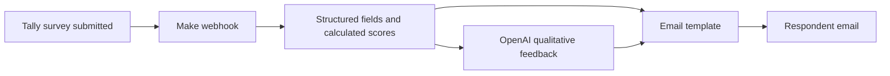

# Survey Automated Response

Portfolio documentation for an automated diagnostic feedback workflow built with Tally, Make, OpenAI, and email delivery.

The workflow turns a completed business diagnostic survey into a respondent-specific feedback email. It combines deterministic scoring from structured multiple-choice answers with a curated qualitative reflection generated by an OpenAI GPT model from the respondent's text answers and selected options.

## What the automation does

1. A respondent completes the Tally diagnostic survey and provides an email address.
2. Make receives the new response through a Tally webhook.
3. Structured survey fields and hidden calculated fields are extracted from the submission.
4. Two deterministic scores are surfaced:
   - Strategic tension, reported on a 0 to 60 scale.
   - Epistemic maturity, reported on a 0 to 12 scale.
5. The OpenAI step receives the score feedback, survey context, open-ended answers, and company profile fields.
6. The generated text is inserted into an HTML email together with the deterministic score summary.
7. The email is sent automatically to the respondent and copied to an internal control account.

## Key design choices

- Hybrid feedback: deterministic scoring provides consistent baseline interpretation, while the GPT-generated section adds context-sensitive synthesis.
- Separation of roles: Tally captures answers and calculated fields, Make orchestrates data movement, OpenAI generates the tailored reflection, and Gmail handles delivery.
- Prompt grounding: the model receives both the already-generated core feedback and selected open-ended context, reducing the chance that the generated text ignores the scoring logic.
- Portfolio-safe documentation: raw respondent data is treated as private; the public repository should document schema and flow rather than expose submissions.

## Repository structure

| File | Purpose |
| --- | --- |
| `README.md` | High-level project narrative and workflow explanation. |
| `PROMPT.md` | Sanitized OpenAI prompt structure used by the Make scenario. |
| `docs/survey-schema.md` | Questionnaire and calculated-field map derived from the Tally submissions export. |
| `make_survey.blueprint.simplified.json` | Valid, simplified scenario blueprint for review and portfolio display. |
| `make_survey.blueprint.json` | Original sanitized Make export retained as source material. |
| `submissions.csv` | Local respondent export used for analysis only; do not publish raw submissions. |

## Questionnaire structure

The survey captures four main categories of input:

- Strategic context: business challenges, blockers, and free-text notes.
- Organizational localization: affected business functions and area-specific criticalities.
- Decision practices: recurring decision questions, information access, decision sources, and tacit expertise.
- Analytics and AI readiness: strategic orientation, perceived risks, and company profile data.

The export also includes hidden or calculated fields used by the automation:

- `Score_1`: strategic tension score shown in the email.
- `Score_2`: epistemic maturity score shown in the email.
- `Feedback_title` and `Feedback_desc`: deterministic feedback labels/descriptions inserted before the generated reflection.
- Intermediate scoring fields such as `Strat_objective`, `Block_severity`, `Functional_load`, `Info_access`, `Decision_make`, and `Know_transfer`.

See [docs/survey-schema.md](docs/survey-schema.md) for the fuller schema summary.

## OpenAI prompt

The OpenAI prompt asks the model to write two to three Italian paragraphs for a business owner. The generated section must expand on the deterministic feedback without repeating it, highlight tensions and weak signals, and support a follow-up diagnostic interview.

The documented prompt uses placeholders instead of live Tally field IDs, Make identifiers, company names, or respondent data. See [PROMPT.md](PROMPT.md).

## Publication notes

The simplified blueprint is intended for documentation and portfolio review. It is not a direct Make import file.
